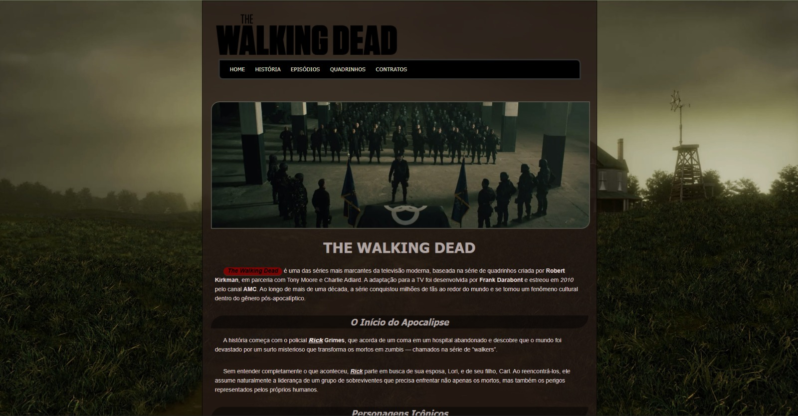
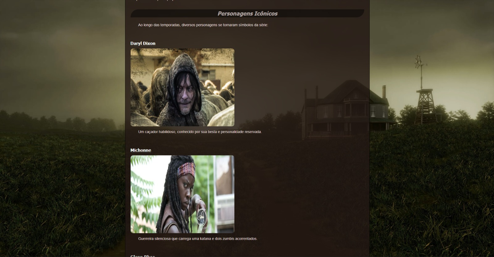
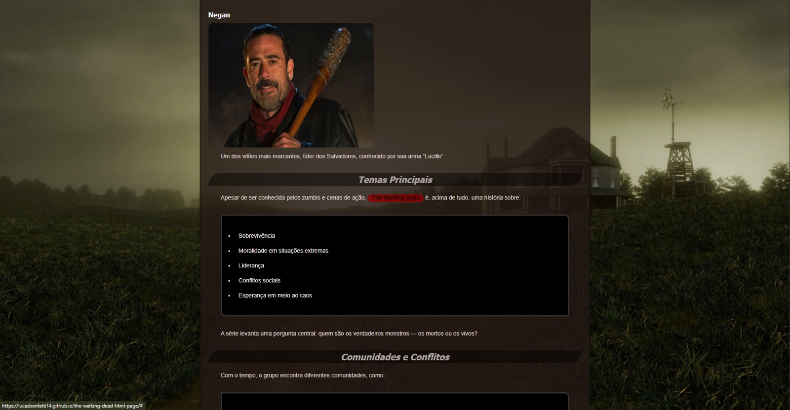
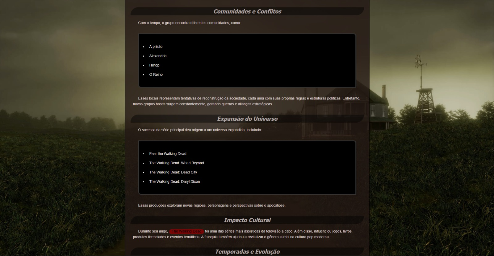
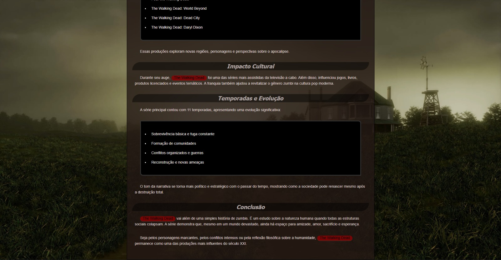

<h1 align="center">🧟‍♂️ The Walking Dead HTML Page</h1>

  💻 Página inspirada na série The Walking Dead  
  📱 Desenvolvida com HTML e CSS

---

  

---

## 🚀 Sobre o projeto

Este projeto consiste no desenvolvimento de uma página inspirada na série The Walking Dead, com foco na aplicação de boas práticas de HTML e CSS.

A página foi estruturada utilizando HTML semântico e estilizada com CSS moderno. O objetivo principal foi criar uma interface visualmente atraente e organizada, destacando informações sobre a série e seus personagens.

---

## 🖥️ Tecnologias utilizadas

  

---

## 🎯 Funcionalidades

* 📄 Estruturação com HTML semântico  
* 🎨 Estilização com CSS moderno  
* 🧭 Navegação simples e intuitiva  
* 🖼️ Organização de conteúdo em seções  
* 🧟‍♂️ Destaque de personagens e temporadas  

---

## 🌐 Acesse o projeto

  

---

## 📸 Preview

    
    
    
    
  

---

## 💡 Aprendizados

* Estruturação de páginas com HTML semântico   
* Organização de seções e componentes  
* Uso de CSS para estilização e design visual  
* Planejamento de conteúdo e hierarquia visual  
* Destaque visual de personagens e elementos temáticos  

---

## 👨‍💻 Autor

  Lucas Benfatti  
  📍 Santos - SP

---

  🚀 Em constante evolução

